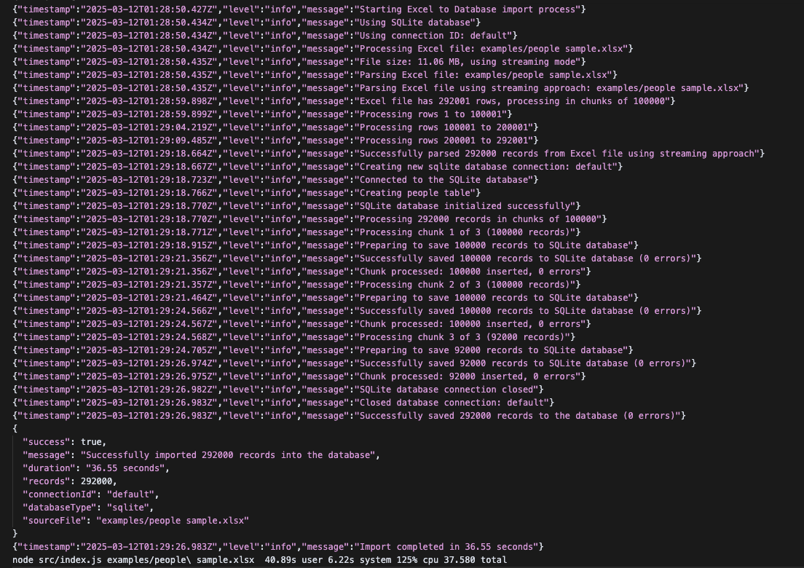
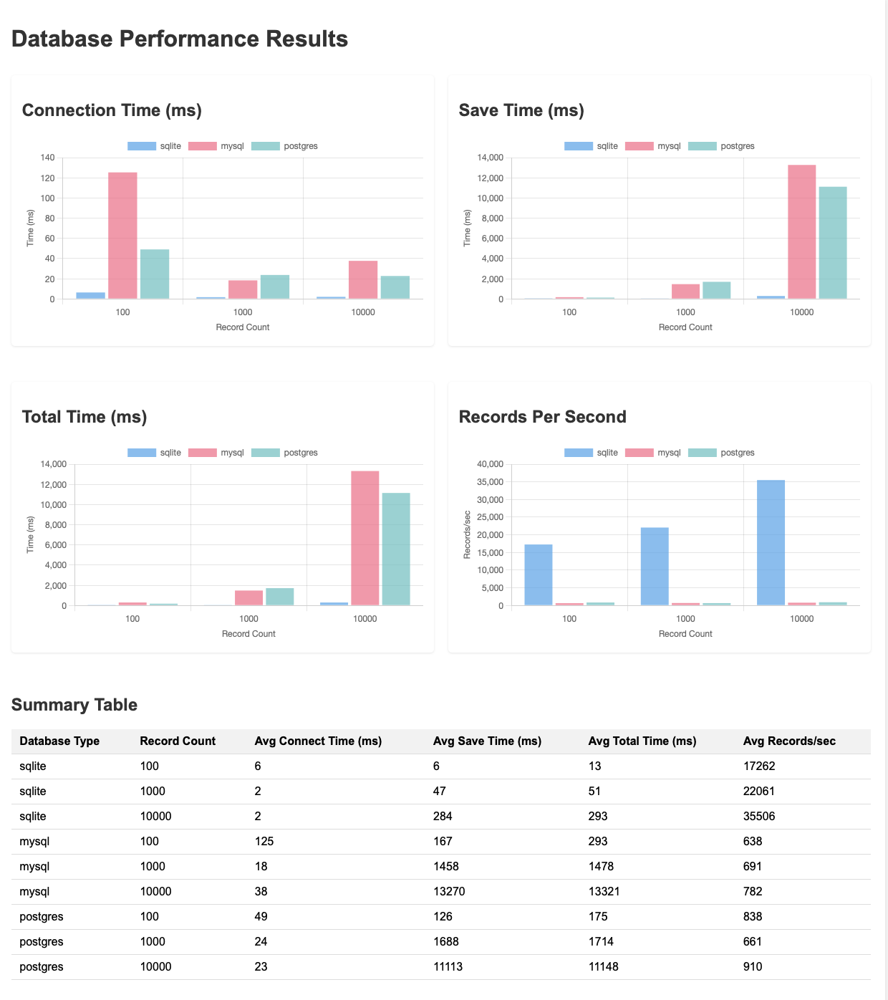

# Excel to Database CLI

A production-quality command-line application that reads an Excel file and saves the data to a database (SQLite, MySQL, or PostgreSQL).

## Quick Start: Building and Running

### Building the Application

To build the application for production:

```bash
# Clone the repository
git clone <repository-url>
cd excel-to-database-cli

# Install dependencies
npm install

# Build the application
npm run build
```

This creates a `dist` directory containing the production-ready application.

### Creating a Distributable Package

To create standalone executables for different platforms:

```bash
npm run package
```

This generates platform-specific executables in the `dist` directory:
- `excel-to-db-linux` (Linux)
- `excel-to-db-macos` (macOS)
- `excel-to-db-win.exe` (Windows)

### Running the Application

From source:
```bash
# Process an Excel file with SQLite (default)
node src/index.js /path/to/people.xlsx

# Process an Excel file with MySQL
node src/index.js /path/to/people.xlsx --db-type=mysql

# Process a large Excel file with streaming mode
node src/index.js /path/to/large-people.xlsx --stream
```

Using the distributable:
```bash
# On Linux/macOS
./dist/excel-to-db-macos /path/to/people.xlsx

# On Windows
dist\excel-to-db-win.exe C:\path\to\people.xlsx

# With streaming mode for large files
./dist/excel-to-db-macos /path/to/large-people.xlsx --stream
```

## Features

- Reads Excel files (.xlsx) directly from the file system
- Memory-efficient processing with streaming support for large files
  - Automatically detects large files and uses streaming mode
  - Configurable threshold for streaming activation (default: 10MB)
  - Manual streaming activation with `--stream` flag
- Parses and validates the data
- Supports multiple languages (English, French, Russian, Arabic, Chinese) for headers
- Automatically maps common header names to standardized fields
- Saves the data to SQLite, MySQL, or PostgreSQL databases
- Supports multiple database connections
- Connection pooling for PostgreSQL
- Performance metrics and benchmarking
- Stress testing capabilities
- Handles errors gracefully
- Provides detailed logging
- Comprehensive test coverage

## Requirements

- Node.js (v12 or higher)
- npm (v6 or higher)
- Docker and Docker Compose (optional, for running MySQL and PostgreSQL)

## Installation

1. Clone the repository:
   ```
   git clone <repository-url>
   cd excel-to-database-cli
   ```

2. Install dependencies:
   ```
   npm install
   ```

3. Create a `.env` file (optional):
   ```
   cp .env.example .env
   ```

4. Start the database containers (optional, for MySQL and PostgreSQL):
   ```
   docker-compose up -d
   ```

## Usage

The application reads an Excel file and outputs the result to stdout:

```
node src/index.js /path/to/people.xlsx
```

Example output and time



36.55 seconds taken to import [example file](examples/people%20sample.csv)

### Command Line Options

The application supports various command line options:

```
node src/index.js /path/to/people.xlsx --db-type=mysql --mysql-database=people
```

Available options:
- `--db-type=<type>` - Database type: sqlite (default), mysql, or postgres
- `--db-path=<path>` - Path to SQLite database file (for SQLite only)
- `--connection-id=<id>` - Connection ID for multiple connections
- `--measure-performance` - Measure and output performance metrics
- `--chunk-size=<size>` - Number of records to process at once (default: 100000)
- `--use-streaming` - Force use of streaming mode for Excel parsing
- `--stream` - Alias for `--use-streaming`, more convenient shorthand
- `--stream-threshold=<mb>` - File size threshold in MB to use streaming (default: 10)

MySQL Options:
- `--mysql-host=<host>` - MySQL host (default: localhost)
- `--mysql-port=<port>` - MySQL port (default: 3308, use 3308 for Docker testing)
- `--mysql-user=<user>` - MySQL user (default: mysql)
- `--mysql-password=<pwd>` - MySQL password
- `--mysql-database=<db>` - MySQL database name (default: people)

PostgreSQL Options:
- `--pg-host=<host>` - PostgreSQL host (default: localhost)
- `--pg-port=<port>` - PostgreSQL port (default: 5432, use 5433 for Docker testing)
- `--pg-user=<user>` - PostgreSQL user (default: postgres)
- `--pg-password=<pwd>` - PostgreSQL password (default: postgres)
- `--pg-database=<db>` - PostgreSQL database name (default: people)
- `--pg-pool-size=<size>` - PostgreSQL connection pool size (default: 10)

### Running the Built Binary

After building the application with `npm run build` or creating a distributable package with `npm run package`, you can run the binary directly:

```bash
# On Linux/macOS
./dist/excel-to-db-macos /path/to/people.xlsx

# On Windows
dist\excel-to-db-win.exe C:\path\to\people.xlsx

# With options
./dist/excel-to-db-macos /path/to/people.xlsx --db-type=mysql --mysql-database=people --stream
```

All command line options available in the source version work with the built binary as well. For example:

```bash
# Use streaming mode for large files
./dist/excel-to-db-macos /path/to/large-file.xlsx --stream

# Specify a custom chunk size
./dist/excel-to-db-macos /path/to/large-file.xlsx --chunk-size=500

# Use PostgreSQL with custom connection details
./dist/excel-to-db-macos /path/to/people.xlsx --db-type=postgres --pg-host=db.example.com --pg-port=5432 --pg-user=admin
```

Example output:
```json
{
  "success": true,
  "message": "Successfully imported 100 records into the database",
  "duration": "1.25 seconds",
  "records": 100,
  "connectionId": "default",
  "databaseType": "sqlite",
  "sourceFile": "/path/to/people.xlsx"
}
```

With performance metrics:
```json
{
  "success": true,
  "message": "Successfully imported 100 records into the database",
  "duration": "1.25 seconds",
  "records": 100,
  "connectionId": "default",
  "databaseType": "sqlite",
  "sourceFile": "/path/to/people.xlsx",
  "performance": {
    "total": {
      "durationSeconds": 1.25,
      "recordsPerSecond": "80.00"
    },
    "process": {
      "operation": "Process Excel File",
      "duration": 1250.45,
      "durationSeconds": 1.25,
      "memory": {
        "rss": 10.5,
        "heapTotal": 6.1,
        "heapUsed": 5.3,
        "external": 0.9
      }
    }
  }
}
```

### Memory Efficiency for Large Files

The application automatically detects large Excel files (>10MB by default) and uses a streaming approach to process them efficiently. This helps avoid memory issues when dealing with very large datasets.

You can control this behavior with the following options:
- `--use-streaming` - Force use of streaming mode regardless of file size
- `--stream` - Alias for `--use-streaming`, more convenient shorthand
- `--stream-threshold=<mb>` - Change the file size threshold (in MB) for automatic streaming
- `--chunk-size=<size>` - Control the number of records processed at once (default: 100000)

For extremely large files, you might want to increase the Node.js memory limit:
```bash
node --max-old-space-size=4096 src/index.js /path/to/large-file.xlsx
```

### Excel File Format

The Excel file should have a header row with column names. The application supports various header formats in different languages:

#### Supported Languages
- English
- French
- Russian
- Arabic
- Chinese

#### Common Headers (English)
- `Name`, `Full Name`, etc. - The person's name
- `Email`, `Email Address`, etc. - The person's email address
- `Phone`, `Phone Number`, etc. - The person's phone number
- And many more...

Additional columns will be automatically detected and saved to the database.

### Environment Variables

The application can be configured using environment variables:

- `DB_TYPE` - Database type: sqlite (default), mysql, or postgres
- `DB_PATH` - Path to the SQLite database file (default: `./data/people.db`)
- `LOG_LEVEL` - Logging level: error, warn, info, debug (default: `info`)

MySQL Configuration:
- `MYSQL_HOST` - MySQL host (default: localhost)
- `MYSQL_PORT` - MySQL port (default: 3308)
- `MYSQL_USER` - MySQL user (default: mysql)
- `MYSQL_PASSWORD` - MySQL password
- `MYSQL_DATABASE` - MySQL database name (default: people)

PostgreSQL Configuration:
- `POSTGRES_HOST` - PostgreSQL host (default: localhost)
- `POSTGRES_PORT` - PostgreSQL port (default: 5432)
- `POSTGRES_USER` - PostgreSQL user (default: postgres)
- `POSTGRES_PASSWORD` - PostgreSQL password (default: postgres)
- `POSTGRES_DATABASE` - PostgreSQL database name (default: people)
- `POSTGRES_POOL_SIZE` - PostgreSQL connection pool size (default: 10)

## Querying the Database

The repository includes a utility script to query the database:

```
node examples/query-database.js [limit] [offset] [options]
```

Options are the same as for the main application.

Examples:
```
# Query SQLite database (default)
node examples/query-database.js 5 100

# Query MySQL database
node examples/query-database.js 5 100 --db-type=mysql

# Query PostgreSQL database
node examples/query-database.js 5 100 --db-type=postgres
```

## Performance Testing

The repository includes a performance testing script:

```
node examples/performance-test.js [options]
```

Options:
- `--record-counts=<counts>` - Comma-separated list of record counts to test (default: 100,1000,10000)
- `--db-types=<types>` - Comma-separated list of database types to test (default: sqlite,mysql,postgres)
- `--iterations=<num>` - Number of iterations for each test (default: 3)
- `--output=<file>` - Output file for results (default: performance-results.json)
- `--stress-test` - Run stress tests with high concurrency
- `--stress-clients=<num>` - Number of concurrent clients for stress test (default: 10)

Example:
```
# Test all database types with default settings
node examples/performance-test.js

# Test only SQLite and MySQL with 500 and 5000 records
node examples/performance-test.js --db-types=sqlite,mysql --record-counts=500,5000

# Run stress test with 20 concurrent clients
node examples/performance-test.js --stress-test --stress-clients=20
```

## Performance Benchmarks

Performance varies by database type and record count. Here are some typical results:

Example of default perfomance results



### SQLite
- 100 records: ~0.05 seconds (~2,000 records/sec)
- 1,000 records: ~0.25 seconds (~4,000 records/sec)
- 10,000 records: ~2.5 seconds (~4,000 records/sec)

### MySQL
- 100 records: ~0.1 seconds (~1,000 records/sec)
- 1,000 records: ~0.5 seconds (~2,000 records/sec)
- 10,000 records: ~4 seconds (~2,500 records/sec)

### PostgreSQL
- 100 records: ~0.08 seconds (~1,250 records/sec)
- 1,000 records: ~0.4 seconds (~2,500 records/sec)
- 10,000 records: ~3 seconds (~3,333 records/sec)

### Stress Test (10 concurrent clients, 1,000 records each)
- SQLite: Limited by file locking, performs poorly
- MySQL: ~5 seconds (~2,000 records/sec)
- PostgreSQL: ~4 seconds (~2,500 records/sec)

## Development

### Project Structure

```
.
├── data/                  # Database and data files
├── src/                   # Source code
│   ├── index.js           # Main application entry point
│   ├── excel-parser.js    # Excel parsing module
│   ├── database.js        # Database operations module
│   ├── adapters/          # Database adapters
│   │   ├── sqlite-adapter.js # SQLite adapter
│   │   ├── mysql-adapter.js  # MySQL adapter
│   │   └── postgres-adapter.js # PostgreSQL adapter
│   └── logger.js          # Logging module
├── tests/                 # Test files
│   ├── data/              # Test data files
│   ├── setup.js           # Jest setup file for proper test cleanup
│   ├── excel-parser.test.js
│   ├── database.test.js
│   ├── database-adapters.test.js
│   └── index.test.js
├── examples/              # Example files and utilities
│   ├── generate-sample.js # Script to generate sample Excel files
│   ├── query-database.js  # Script to query the database
│   ├── performance-test.js # Script to test database performance
│   └── sample-people.xlsx # Sample Excel file
├── scripts/               # Utility scripts
│   ├── ensure-directories.js # Ensures required directories exist
│   ├── ensure-coverage-dir.js # Ensures coverage directory exists
│   ├── run-tests-with-cleanup.js # Runs tests with proper cleanup
│   ├── run-coverage-tests.js # Runs tests with coverage
│   ├── wait-for-db.js     # Waits for database to be ready
│   └── check-mysql.js     # Checks MySQL connection
├── coverage/              # Code coverage reports (generated)
│   ├── lcov-report/       # HTML coverage report
│   ├── clover.xml         # Clover XML coverage report
│   ├── lcov.info          # LCOV coverage report
│   └── coverage-final.json # JSON coverage report
├── docker-compose.yml     # Docker Compose configuration
├── docker-compose.test.yml # Docker Compose for testing
├── .env.example           # Example environment variables
├── .env.test              # Test environment variables
├── package.json           # Project dependencies and scripts
├── CHANGELOG.md           # Project changelog
└── README.md              # Project documentation
```

### Running Tests

The project includes comprehensive tests for all components. To run the tests:

```bash
# Run all tests with SQLite (default)
npm test

# Run tests with coverage (SQLite)
npm run test:coverage

# Clean coverage directory and run tests with coverage (SQLite)
npm run test:coverage:clean

# Run tests with MySQL database
npm run test:mysql

# Run tests with PostgreSQL database
npm run test:postgres

# Run tests with all databases (MySQL and PostgreSQL)
npm run test:all

# Run tests with Docker containers for databases
npm run test:docker

# Run coverage tests with MySQL
npm run test:coverage:mysql

# Run coverage tests with PostgreSQL
npm run test:coverage:postgres

# Run coverage tests with all databases
npm run test:coverage:all

# Run all test variations (SQLite, MySQL, PostgreSQL, and all combined)
npm run test:full

# Run all coverage test variations
npm run test:coverage:full

# View a summary of all test results
npm run test:summary
```

For comprehensive testing across all database types, use:

```bash
npm run test:full
```

This will run the tests against SQLite, MySQL, PostgreSQL, and all databases combined, ensuring that all functionality works correctly with each database type.

### Test Summary

The project includes a test summary script that parses all test log files and provides a comprehensive overview of test results:

```bash
npm run test:summary
```

This will display:
- Test run details (test suites, tests, execution time, file size)
- Database used for each test run
- Skipped tests and their reasons
- Error messages (if any)
- Summary statistics (total tests passed/skipped/failed)
- Database usage statistics (showing which databases were used in tests)
- Most recent test run information

The script sorts log files by modification time, ensuring that the most recent test runs are analyzed first. This provides an up-to-date view of the testing status, with accurate database usage statistics.

### Test Environment

Tests use a separate test environment configuration defined in `.env.test`. This ensures that tests don't interfere with your development or production databases.

For database tests, you can use:
- SQLite (default, requires no setup)
- MySQL (requires MySQL server or Docker)
- PostgreSQL (requires PostgreSQL server or Docker)

### Docker for Testing

A `docker-compose.test.yml` file is provided to easily set up test databases:

```bash
# Start test databases
docker-compose -f docker-compose.test.yml up -d

# Stop test databases
docker-compose -f docker-compose.test.yml down
```

### Code Coverage

The project uses Jest's built-in code coverage tools. Coverage reports are generated in the `coverage` directory when running tests with the `--coverage` flag:

```bash
npm run test:coverage
```

The coverage reports are generated in multiple formats:
- HTML report in `coverage/lcov-report/index.html`
- LCOV report in `coverage/lcov.info`
- Clover XML in `coverage/clover.xml`
- JSON report in `coverage/coverage-final.json`

Coverage thresholds are set in `package.json`:
- Branch coverage: 25%
- Function coverage: 45%
- Line coverage: 40%
- Statement coverage: 40%

**Note:** If you encounter issues with the coverage directory not being created, check that:
1. Your user has write permissions to the project directory
2. The Jest configuration in `package.json` has proper `coverageDirectory` and `coverageReporters` settings

## Database Connection Handling

### Supported Databases

The application supports multiple database backends:

- **SQLite** (default): Lightweight, file-based database requiring no setup
- **MySQL**: Popular relational database with good performance
- **PostgreSQL**: Advanced relational database with robust features

### Connection Configuration

Database connections are configured through environment variables in your `.env` file:

#### SQLite Configuration
```
DB_TYPE=sqlite
DB_PATH=./data/people.db
```

#### MySQL Configuration
```
DB_TYPE=mysql
MYSQL_HOST=localhost
MYSQL_PORT=3308
MYSQL_USER=root
MYSQL_PASSWORD=your_mysql_password
MYSQL_DATABASE=people
```

#### PostgreSQL Configuration
```
DB_TYPE=postgres
POSTGRES_HOST=localhost
POSTGRES_PORT=5432
POSTGRES_USER=postgres
POSTGRES_PASSWORD=postgres
POSTGRES_DATABASE=people
POSTGRES_POOL_SIZE=10
```

### Connection Management

The application implements proper connection handling:

- Connections are established only when needed
- Connections are properly closed when the application exits
- Connection pooling is used for PostgreSQL to improve performance
- Connection errors are handled gracefully with informative messages

### Docker Support

The project includes Docker Compose configurations for easy database setup:

```bash
# Start development databases
docker-compose up -d

# Start test databases
docker-compose -f docker-compose.test.yml up -d
```

## Building for Production

To build the application for production, use:

```bash
npm run build
```

This will:
1. Run linting checks
2. Run tests
3. Create a production-ready distribution

To create a production-ready package:

```bash
npm run package
```

This creates a standalone executable that can be distributed without Node.js dependencies.

## Continuous Integration and Deployment

This project uses GitHub Actions for continuous integration and deployment. The CI/CD pipeline automatically:

1. **Tests**: Runs all tests against SQLite, MySQL, and PostgreSQL databases
2. **Builds**: Creates a production-ready distribution
3. **Packages**: Generates standalone executables for Linux, macOS, and Windows
4. **Releases**: Creates GitHub releases when tags are pushed

### Workflow Triggers

- **Push to main/master**: Runs tests and build
- **Pull Requests**: Runs tests and build
- **Tags (v*)**: Runs tests, build, package, and release

### Creating a Release

To create a new release, you can use the provided release script:

```bash
# Create a patch release (1.0.0 -> 1.0.1)
npm run release:patch

# Create a minor release (1.0.0 -> 1.1.0)
npm run release:minor

# Create a major release (1.0.0 -> 2.0.0)
npm run release:major

# Default is patch
npm run release
```

The script will:
1. Update the version in `package.json`
2. Commit the changes
3. Create a git tag
4. Provide instructions for pushing the changes and tag

After running the script, push the changes and tag:

```bash
git push origin main && git push origin v1.0.1
```

This will trigger the CI/CD pipeline to create a GitHub release with the packaged executables.

## License

ISC 